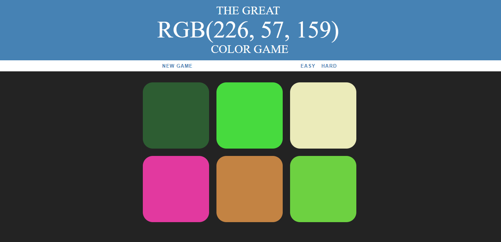

# The Great ColorGame
## A simple game, for those who want to improve their RGB color skills. 

There are 6 colored sqaure boxes and all of them have a random color in them, which are selected duringthe start of the application. Out of these colors in the boxes, one color is choosen randomly and its RGB value is displayed on the top of the page, seen in the picture. User has to guess the colored box whose color is displayed on the top.

Please see the image of the working game.

